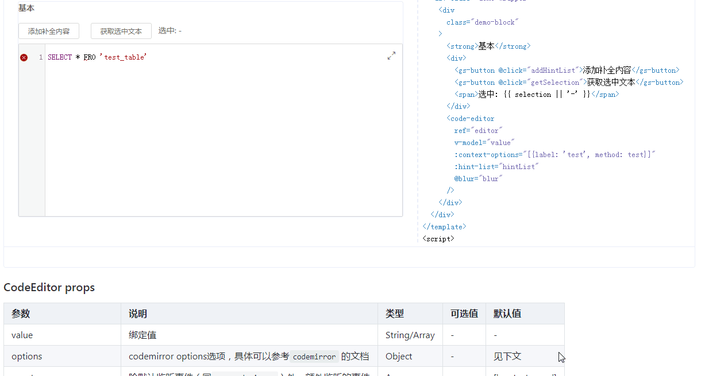

# code-editor

>  一个默认支持美化、高亮、报错、格式化、注释、补全、缩放的代码编辑器(sql为默认语言)，主体基于Vue和[CodeMirror](https://github.com/codemirror/CodeMirror)等。

## Install

```bash
npm install @boldarialblack/code-editor -S
```

## Quick Start

```bash
import Vue from 'vue'
import CodeEditor from '@boldarialblack/code-editor'
# Vue.component('code-editor', CodeEditor) # 可以指定组件名称
Vue.use(CodeEditor) # 组件名称 `code-editor`
```

For more information, please refer to [CodeEditor](https://github.com/BoldArialBlack/code-editor.git) in our documentation.

## Build Setup

``` bash
# install dependencies
npm install

# serve with hot reload at localhost:8080
npm run dev

# build for demo with minification
npm run demo:build

# build for gh-pages with minification
npm run demo:prepublish

# build for production with minification
npm run build

# generate gh-pages
npm run deploy
```

## LICENSE

[MIT](http://opensource.org/licenses/MIT)

## 截图



## 基本用法
```
<template>
  <div class="vd-demo__block vd-demo__block-2">
    <div style="display: flex">
      <el-button @click="addHintList">
        添加补全内容
      </el-button>
      <el-button @click="getSelection">
        获取选中文本
      </el-button>
      <span>选中: {{ selection || '-' }}</span>
    </div>
    <code-editor
      ref="editor"
      v-model="value"
      :context-options="[{label: 'test', method: test}]"
      :events="['contextmenu', 'blur']"
      :hint-list="hintList"
      context-append-to-body
      @blur="blur"
      @ready="ready"
    />
  </div>
</template>
```
```
<script>
// 可单独引入外部sqlLint语法检查插件
/* import { Parser } from 'node-sql-parser';
window.sqlLint = new Parser();  */
/* 也支持dt-sql-parser
import { parser } from 'dt-sql-parser';
window.sqlLint = parser;
*/

  export default {
    data () {
      return {
        value: 'SELECT * FRO \'test_table\'',
        hintList: {},
        selection: ''
      }
    },
    methods: {
      test() {
        console.log('test');
      },
      ready() {
        console.log('ready');
      },
      blur() {
        console.log('blur');
      },
      addHintList() {
        this.hintList[`hint${Object.keys(this.hintList).length + 1}`] = [];
      },
      getSelection() {
        this.selection = this.$refs.editor.getSelection();
      }
    }
  }
</script>
```


## CodeEditor props

| 参数   | 说明  | 类型  | 可选值  | 默认值  |
|----------|---------|---------|-----------|-----------|
| value | 绑定值 | String/Array  | - | - |
| options | codemirror options选项，具体可以参考`codemirror` 的文档 | Object  | - | 见下文 |
| events | 除默认监听事件外(changes,beforeChange,scroll)，额外监听的事件，具体可以参考`vue-codemirror`和`codemirror`的文档 | Array  | - | ['contextmenu'] |
| hint-list | 补全内容的数据源 | Object  | - | - |
| sizeable | 是否可以进行编辑区放大缩小 | Boolean  | - | true |
| context-menu | 是否开启右键菜单自定义 | Boolean  | - | true |
| context-options | 未选中文本时右键菜单选项 | Array  | - | - |
| selected-context-options | 选中文本时右键菜单选项 | Array  | - | - |
| formatable | 右键菜单选项是否有`格式化/格式化选中`选项 | Boolean  | - | true |
| commentable | 右键菜单选项是否有`切换注释/切换注释选中`选项，如未引入`codemirror/addon/comment/comment`则自动隐藏 | Boolean  | - | true |
| format-text | 右键菜单`格式化/格式化选中`选项文案 | String | - | 格式化 |
| comment-text | 右键菜单`切换注释/切换注释选中`选项文案 | String | - | 切换注释 |
| z-index | 右键菜单的z-index属性 | Number  | - | 30000 |
| context-append-to-body | 右键菜单是否挂载在body上 | Boolean | - | false |
| line-comment | 注释的前缀符号 | String | - | -- |
| sql-lint | 是否对输入内容进行sql语法检查，sqlLint插件支持外部引入(如`node-sql-parser`/`dt-sql-parser`) | Boolean  | - | true |
| props | codemirror配置选项，具体可以参考`code-mirror` 的文档 | Object  | - | - |
| mask-props | mask配置选项，具体可以参考 `gs-mask` 的文档 | Object  | - | - |
| hint-props | codemirror中showHint函数传参选项，具体可以参考 `codemirror` 的文档 | Object  | - | - |

### CodeEditor Methods
| 方法名   | 说明  | 参数  |
|----------|---------|---------|
| refresh | 刷新编辑器 | - |
| getSelection | 获取编辑器选中文本 | - |

### CodeEditor events(除编辑器监听事件外)
| 事件名称   | 说明  | 回调参数  |
|----------|---------|---------|
| ready | 编辑框初始化完成事件 | codemirror |
| visible-change | mask遮罩（放大/缩小）变化事件 | true/false |
| on-context-menu | 编辑框内点击右键事件 | instance, event, gutter, line |
| menu-content-click | 非浏览器默认右键菜单选中事件 | method, selection |

### CodeEditor slot
|    名称   | 说明  |
|----------|---------|
| - | 右键菜单 |

### CodeEditor options 默认值
```
  tabSize: 4,
  styleActiveLine: true,
  lineNumbers: true,
  line: true,
  extraKeys: {
    'Tab': 'autocomplete',
    'Ctrl-/': this.toggleComment
  },
  mode: 'text/x-mysql',
  addOverlay: 'text/x-mysql',
  gutters: ['CodeMirror-lint-markers'],
  lint: this.sqlLint,
  matchBrackets: true,
  hintOptions: {
    completeSingle: false,
    tables: this.hintList
  },
  delay: 700
```

### CodeEditor 语法检查（实验）
目前要对输入进行语法检查有两种方法：
#####  外部插件检查
用法：
1. 引入报错js：`import 'codemirror/addon/lint/lint';`和``import 'code-editor/lint/sql-lint';`
2. 安装选择的语法检查插件（目前明确支持的有`node-sql-parser`和`dt-sql-parser`插件），并且引入后将window.sqlLint配置

Demo:
```javascript
import 'codemirror/addon/lint/lint';
import 'code-editor/lint/sql';

// 按需引入sqlLint语法检查插件
import { Parser } from 'node-sql-parser';
window.sqlLint = new Parser();
/* 也支持dt-sql-parser
import { parser } from 'dt-sql-parser';
window.sqlLint = parser;
*/
```
##### 内部工具检查(Deprecated)
已修改为默认检查，无需单独
1. 引入语法检查js：`import 'code-editor/parser/sql';`或`import 'code-editor/parser/hive';`
2. 引入报错js：`import 'codemirror/addon/lint/lint';`和`import 'code-editor/lint/sql';`